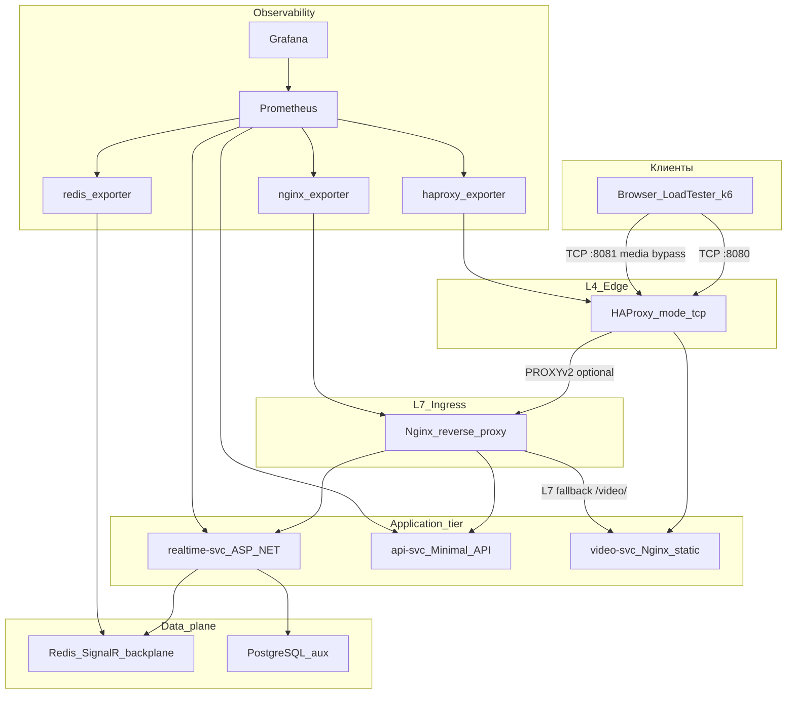

# Архитектура

## Введение

**highload-realtime-signalr-demo** — портфолио-демо высоконагруженного real-time на **.NET**: SignalR (WebSockets + MessagePack), горизонтальное масштабирование через **Redis backplane**, гибридный вход **HAProxy (L4) + Nginx (L7)** и наблюдаемость через **OpenTelemetry → Prometheus → Grafana**. Репозиторий намеренно остаётся воспроизводимым в **Docker Compose**, но архитектурные решения описаны так, как их ожидали бы на **Senior / Lead** интервью: с явными границами ответственности, компромиссами и путём эволюции к Kubernetes.

Цели архитектуры: показать **разделение профилей нагрузки** (долгоживущие соединения, короткие REST, статический/byte-range media), **предсказуемую деградацию** под burst (batching, rate limiting, bounded queues) и **измеримый** hot path — без «магии» и без смешения edge-L4 с HTTP-маршрутизацией там, где это вредит модели.

## Целевые характеристики

| Измерение | Цель демо | Как закрывается в коде / инфраструктуре |
|-----------|-----------|------------------------------------------|
| **Concurrency** | Много одновременных WebSocket | Kestrel limits, Nginx upgrade, sticky к одной реплике |
| **Throughput** | Высокий fan-out сообщений | MessagePack, batching, Redis pub/sub между репликами |
| **Scale-out** | Несколько инстансов без «тихих комнат» | Redis backplane + L7 affinity + метрики per-instance |
| **Resilience** | Контролируемая деградация | Bounded channel, per-connection rate limit, health/readiness |
| **Observability** | Видеть узкие места до flame graph | OTLP metrics, Redis exporter, HAProxy/Nginx exporters |

## Целевая архитектура

Внешний контур: **клиент → HAProxy (TCP)**. Умная маршрутизация по **HTTP path** и политики L7 живут на **Nginx**. Три сервисных профиля: **`realtime-svc`** (SignalR + hosted Blazor UI), **`api-svc`** (REST), **`video-svc`** (статический VOD с byte-range). **Redis** — backplane для межрепликового fan-out SignalR. **PostgreSQL** — вспомогательная персистентность и readiness, вне hot path сообщений.

**Локальные порты (compose):** `:8080` — основной трафик (HAProxy → Nginx → realtime/api); `:8081` — **media bypass** напрямую в `video-svc`; `:8404` — HAProxy stats (и CSV для exporter).

## Ключевые архитектурные решения

### 1. Гибрид L4 + L7: HAProxy + Nginx

| Решение | Обоснование |
|---------|-------------|
| **HAProxy в `mode tcp` на входе** | Максимально быстрый приём TCP-сессий, health на уровне сокета, stats; **не** пытается читать HTTP path — это честная модель L4. |
| **Nginx за HAProxy для HTTP/WebSocket** | Path-based routing, `Upgrade`, таймауты для long-lived соединений, `limit_req`, единая точка для политик перед приложением. |
| **PROXY protocol (v2) между уровнями** | Сохранение исходного client IP за NAT/L4 без завязки приложения на нестандартные заголовки на edge. |

**Ограничение, которое важно произнести вслух:** в чистом TCP L4 **нельзя** честно развести `/api` и `/hubs` по **одному** порту без TLS-inspection или без перевода HAProxy в HTTP mode. Поэтому **media bypass** вынесен на **отдельный frontend/порт** (`:8081`), а не «магический» path-routing на L4.

### 2. Разделение: `realtime-svc`, `api-svc`, `video-svc`

| Сервис | Роль | Зачем отдельно |
|--------|------|----------------|
| **realtime-svc** | SignalR Hub, MessagePack, batching, UI (Blazor WASM hosted) | Другой профиль CPU/GC/WebSocket, другие таймауты и лимиты, чем у REST. |
| **api-svc** | Minimal API, короткие HTTP | Не смешивать RPS коротких запросов с fan-out и backpressure real-time слоя. |
| **video-svc** | Nginx + статический контент, VOD через byte-range | Большие ответы и кэширование; возможность **обойти** L7 без участия Kestrel. |

Демо не претендует на полный **bounded context** микросервисов, но демонстрирует **разделение по нагрузочному профилю** — шаг, который в проде часто делают раньше, чем «резать» домен на 20 сервисов.

### 3. Media bypass (L4 → video-svc)

| Аспект | Смысл |
|--------|--------|
| **Путь `:8081`** | Клиент попадает в `video-svc` без прохождения через Nginx L7 — меньше hop-ов для крупных тел ответов. |
| **Путь `:8080/video/*` через Nginx** | Осознанный **fallback** для сравнения: тот же контент, но через smart ingress (политики, логирование, единая точка TLS в проде). |

### 4. Sticky sessions + Redis backplane

| Механизм | Назначение |
|----------|------------|
| **L7 affinity** (consistent hash по клиентскому IP в Nginx) | Negotiate и WebSocket попадают на **одну** реплику `realtime-svc`, что снижает «дребезг» соединений при scale. |
| **Redis backplane (SignalR)** | После sticky сообщения всё равно **согласованно** доходят до подписчиков на **других** репликах через pub/sub. |

Sticky **не** заменяет backplane: он уменьшает лишние reconnect и упрощает эксплуатацию; **семантика broadcast между репликами** остаётся на Redis.

### 5. Backpressure и batching

| Компонент | Поведение |
|-----------|-----------|
| **Bounded channel + `BatchedMessageDispatcher`** | Burst-трафик сглаживается окнами; Hub шлёт `ReceiveBatch` вместо лавины одиночных отправок. |
| **Per-connection rate limiter** | Защита от шумных клиентов без глобального «вырубания» всего сервиса. |
| **ASP.NET Core `RateLimiter`** | Отдельный лимит на negotiate vs остальной HTTP — защита edge от перегруза handshake. |

Метрики `signalr_batch_queue_depth`, `signalr_messages_dropped_total`, `signalr_requests_rate_limited_total` — **индикаторы** того, что система вошла в режим контролируемой деградации, а не «молча» деградирует.

## Потоки данных

### SignalR: broadcast / group

1. Клиент открывает TCP к **HAProxy** `:8080`.
2. HAProxy проксирует сессию к **Nginx** (при включённом PROXY v2 Nginx видит исходный IP для sticky/логов).
3. Nginx по path (`/hubs/realtime`, алиасы `/realtime/*`, `/hub/*`) и sticky направляет на конкретный под **`realtime-svc`**.
4. После negotiate клиент держит WebSocket; Hub обрабатывает вызовы (`SendBroadcast`, `SendToGroup`, …).
5. Публикация на одной реплике уходит в **локальный** fan-out; для остальных реплик — событие через **Redis backplane**.
6. Каждая реплика доставляет сообщение **своим** локальным соединениям.

### REST API

1. HTTP к HAProxy `:8080` → Nginx.
2. Nginx по префиксу `/api/*` балансирует на **`api-svc`** (в compose — `least_conn`; на практике часто добавляют отдельные лимиты и auth).
3. Ответ идёт обратным путём; метрики `api_requests_total` и HTTP RED на стороне `api-svc` дают отдельный срез от SignalR.

### Media: bypass и fallback

| Сценарий | Маршрут |
|----------|---------|
| **Bypass** | `GET :8081/video/...` → HAProxy → **напрямую** `video-svc` (Nginx отдаёт статику, `Accept-Ranges: bytes` для byte-range). |
| **L7 fallback** | `GET :8080/video/...` → HAProxy → Nginx → `video-svc` — тот же контент, но через ingress (политики, единая точка наблюдения L7). |

## Observability

Принцип: **не только приложение**, но и **edge + data plane**, иначе при инциденте «всё тормозит» вы не отличите saturation L7 от starvation Redis.

### Критичные метрики (realtime-svc / OTLP)

| Метрика | Зачем смотреть |
|---------|----------------|
| `signalr_active_connections` | Текущая concurrent нагрузка; коррелирует с file descriptors и памятью. |
| `signalr_messages_published_total` / `delivered_total` | Сквозной throughput; расхождение с Redis — сигнал потерь/фильтрации. |
| `signalr_publish_latency_ms` | Задержка публикации на сервере; рост при плоском RPS → GC, lock contention, Redis. |
| `signalr_batch_queue_depth` | Заполнение bounded очереди — ранний индикатор backpressure. |
| `signalr_messages_dropped_total` | Явная деградация: система предпочла сбросить, чем умереть полностью. |
| `signalr_requests_rate_limited_total` | Шумные клиенты / negotiate storm. |
| `process_cpu_time_seconds_total`, `process_working_set_bytes` | Классика runtime: CPU без роста throughput часто = аллокации; память без RPS = утечки или кэш. |

### Инфраструктура

| Источник | Зачем |
|----------|-------|
| **redis_exporter** | Память, commands/s, blocked clients — backplane как узкое место. |
| **haproxy_exporter** | Frontend/backend health, session rate — saturation на L4. |
| **nginx_exporter** | RPS, активные соединения L7 — отличить ingress от приложения. |

Grafana dashboard в репозитории агрегирует сигнал приложения и может включать панели по proxy/API — это **единая** картина для демо post-mortem.

## Performance Tuning

После тяжёлого прогона на `5000` соединений архитектура была дополнительно настроена под controlled load:

| Область | Настройка |
|---------|-----------|
| **Kestrel** | лимиты `MaxConcurrent* = 50000`, `SocketBacklog = 32768`, короткий `RequestHeadersTimeout` |
| **ThreadPool** | заранее поднятые min threads и верхний guard rail через `SetMaxThreads` |
| **SignalR** | меньший `MaximumReceiveMessageSize`, `StreamBufferCapacity = 8`, `HandshakeTimeout = 5s` |
| **Redis** | tighter timeouts, retry, keepalive, отдельные memory/output buffer лимиты |
| **Backpressure** | bounded queue `20000`, high watermark `70%`, быстрый flush `20 ms`, per-connection token bucket |
| **LoadTester** | `--send-interval-ms=1000` для latency baseline; `0`/низкие значения только для throughput stress |
| **Proxy** | HAProxy backlog/maxconn, Nginx `worker_connections`, upstream keepalive, L7 rate limit на negotiate |

Полная методика и команды: [performance-tuning.md](./performance-tuning.md).

## Трейдоффы

| Плюс | Цена |
|------|------|
| Чёткое разделение L4/L7 и media bypass | Больше moving parts: конфиги, health checks, версии образов. |
| Sticky + Redis даёт предсказуемый scale-out story | Redis — **SPOF** для межрепликового fan-out; нужен HA Redis / Cluster в проде. |
| IP-hash sticky прост в compose | За NAT/CDN все клиенты могут выглядеть как один IP → перекос реплик; в проде обычно **cookie-based** affinity. |
| Compose без оркестратора | DNS/service discovery и rolling update **не** как в Kubernetes; поведение при `--scale` надо понимать как учебное. |
| Open-source Nginx без Plus | Нет встроенных active health checks upstream как в коммерческом продукте; опора на readiness приложения и внешние пробы. |

## Дальнейшее развитие

Путь от текущего compose к «как у больших» — не переписывание с нуля, а **сохранение идей** и смена площадки:

1. **Kubernetes:** `Deployment` для `realtime-svc`, `api-svc`, `video-svc`; отдельный `Ingress` или Gateway API с TLS и cookie affinity.
2. **Service mesh (опционально):** mTLS, retries, outlier detection — после того, как зафиксированы SLO по сервисам.
3. **Redis:** Cluster / Sentinel / managed — убрать single-point и дать горизонталь pub/sub под рост fan-out.
4. **Managed real-time (например Azure SignalR):** если цель — масштаб соединений выше «самоката» на Redis.
5. **OTLP Collector + remote TSDB** (Mimir / VM / Thanos): дешёвое долгое хранение метрик и алерты по SLO.
6. **Несколько load-generator нод:** иначе генератор сам станет bottleneck при 50k+ соединений.

## Заключение

Эта архитектура демонстрирует **senior-level** мышление не количеством технологий, а **ясностью границ**: где заканчивается fast TCP edge и начинается HTTP-политика; где живёт stateful real-time vs stateless REST vs byte-heavy media; как **измерить** деградацию до того, как пользователь уйдёт; и как честно назвать компромиссы **до** вопроса интервьюера. Compose — удобная витрина; описанный контур — хороший фундамент для разговора о production.

## Связанные документы

- [Запуск и порты](./setup.md)
- [Нагрузка и baseline](./performance.md)
- [Стек](./tech-stack.md)
- [ADR: Redis backplane](../adr/0001-use-signalr-with-redis-backplane.md)
- [ADR: HAProxy + Nginx](../adr/0002-hybrid-l4-l7-load-balancing.md)
